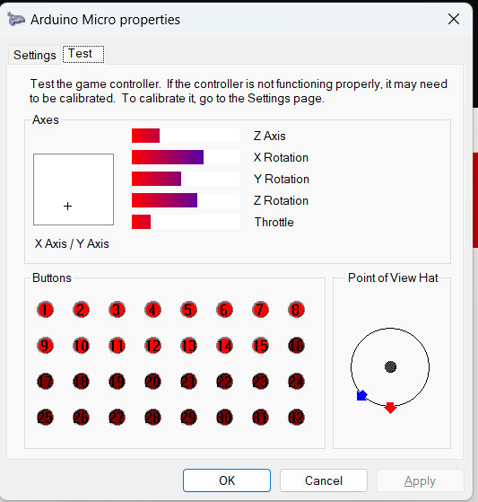
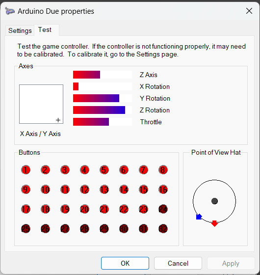
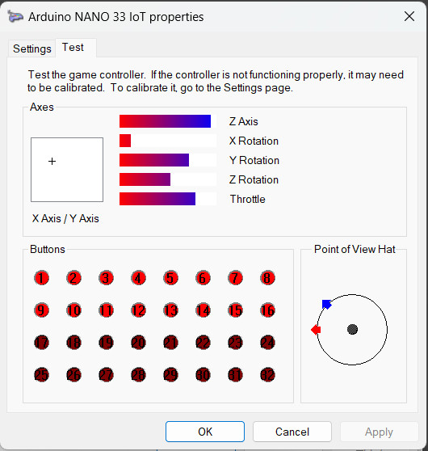
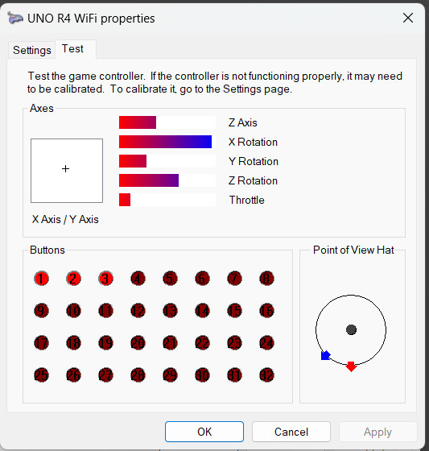

# Arduino USB Joystick for Windows

USB HID Joystick with 11 axes, 2 8-way direction pads, and 32 buttons.  These
are apparently the limits of the Windows generic joystick device driver.

The following joystick class works when plugged into a computer running Windows
11 and a computer running Ubuntu Linux. The class depends only on HID.h and
does not contain board specific code so it may work on other boards.

Oddly on some boards (Uno R4 WiFi and Due), the Serial port must be opened to
use the joystick. This code is in the test sketch, not the Joystick class.

## Tested boards

The joystick properties window does not show all the axes. The Point
of View Hat has two indicator arrows because there are two direction hats.

<em>Arduino Micro (same processor as in Pro Micro and Leonardo) running JoystickWin on Win11</em>

<em>Arduino Due running JoystickWin on Win11</em>

<em>Arduino Nano 33 IoT running JoystickWin on Win11</em>

<em>Arduino Uno R4 WiFi running JoystickWin on Win11</em>

## Limitations

This driver does not work on Arduino boards using mbed because mbed USB
works differently. For example, Giga R1.

This driver does not work on boards without an integrated USB controller such
as Uno and Mega. See UnoJoy.

This driver is a generic jumbo joystick that does not emulate any commercial
joystick/gamepad such as PS3 or Xbox 360 so game software that require a
specific brand/model of joystick/gamepad will not work.
